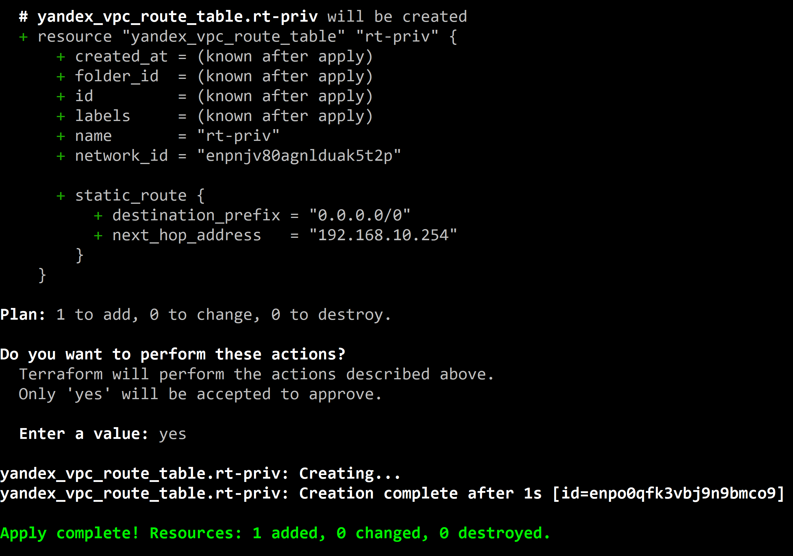
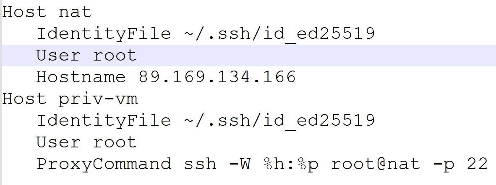
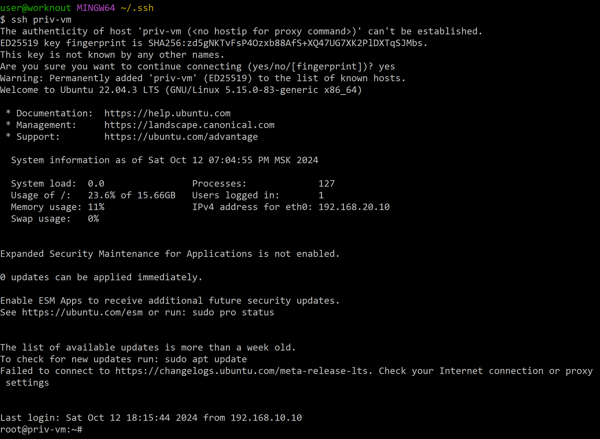

# Домашнее задание к занятию «Организация сети» - Илларионов Дмитрий

### Подготовка к выполнению задания

1. Домашнее задание состоит из обязательной части, которую нужно выполнить на провайдере Yandex Cloud, и дополнительной части в AWS (выполняется по желанию). 
2. Все домашние задания в блоке 15 связаны друг с другом и в конце представляют пример законченной инфраструктуры.  
3. Все задания нужно выполнить с помощью Terraform. Результатом выполненного домашнего задания будет код в репозитории. 
4. Перед началом работы настройте доступ к облачным ресурсам из Terraform, используя материалы прошлых лекций и домашнее задание по теме «Облачные провайдеры и синтаксис Terraform». Заранее выберите регион (в случае AWS) и зону.

---
### Задание 1. Yandex Cloud 

**Что нужно сделать**

1. Создать пустую VPC. Выбрать зону.

Создал см: `vpc.tf`

Но, пока создал только сети (сразу и приватную и публичную), и, не делал никакие таблицы маршрутизации - смотрю как будет по умаолчанию.

2. Публичная подсеть.

 - Создать в VPC subnet с названием public, сетью 192.168.10.0/24.

Создал, см: `vpc.tf`

 - Создать в этой подсети NAT-инстанс, присвоив ему адрес 192.168.10.254. В качестве image_id использовать fd80mrhj8fl2oe87o4e1.

Создал, см: `nat.tf`

 - Создать в этой публичной подсети виртуалку с публичным IP, подключиться к ней и убедиться, что есть доступ к интернету.

Создал, см: `pub-vm.tf`

Созданные ВМ:


Подключился к ВМ и проверил что есть доступ в Интернет:


Так же есть доступ к priv-vm и nat:


Потом еще подложил свой приватный ключ на ВМ pub-vm и с нее через ssh подключился к priv-vm:


При этом из priv-vm нет доступа в интернет:


Но, есть доступ к nat:


и есть доступ сетевой к pub-vm:


3. Приватная подсеть.
 - Создать в VPC subnet с названием private, сетью 192.168.20.0/24.

см: `vpc.tf` создал сразу раньше.

 - Создать route table. Добавить статический маршрут, направляющий весь исходящий трафик private сети в NAT-инстанс.

Добавил код в `rout-table.tf` :

Пример брал от сюда:
https://yandex.cloud/ru/docs/vpc/operations/static-route-create

```
resource "yandex_vpc_route_table" "rt-priv" {
  name       = "rt-priv"
  network_id = "${yandex_vpc_network.cloud-net.id}"

  static_route {
    destination_prefix = "0.0.0.0/0"
    next_hop_address   = yandex_compute_instance.nat.network_interface.0.ip_address #yandex_vpc_gateway.nat_gateway.id
  }
}
```


Но, не сработало - пинга в интернет так и нет:


Т.к. еще таблицу маршрутизации нужно привязать к подсети, добавил в `vpc.tf`:

```
  route_table_id = yandex_vpc_route_table.rt-priv.id
```
для `resource "yandex_vpc_subnet" "private"`
см: `vpc.tf`


После этого пинги в интернет пошли:


 - Создать в этой приватной подсети виртуалку с внутренним IP, подключиться к ней через виртуалку, созданную ранее, и убедиться, что есть доступ к интернету.

Пинги идут.

И остались пинги к pub-vm:


Еще отработал подключение к priv-vm "в одно касание" через ssh config:

В конфиге на своем ПК создал:



После чего подключился к ВМ через NAT в одну команду:



---

Resource Terraform для Yandex Cloud:

- [VPC subnet](https://registry.terraform.io/providers/yandex-cloud/yandex/latest/docs/resources/vpc_subnet).
- [Route table](https://registry.terraform.io/providers/yandex-cloud/yandex/latest/docs/resources/vpc_route_table).
- [Compute Instance](https://registry.terraform.io/providers/yandex-cloud/yandex/latest/docs/resources/compute_instance).

---
### Задание 2. AWS* (задание со звёздочкой)

Это необязательное задание. Его выполнение не влияет на получение зачёта по домашней работе.

**Что нужно сделать**

1. Создать пустую VPC с подсетью 10.10.0.0/16.
2. Публичная подсеть.

 - Создать в VPC subnet с названием public, сетью 10.10.1.0/24.
 - Разрешить в этой subnet присвоение public IP по-умолчанию.
 - Создать Internet gateway.
 - Добавить в таблицу маршрутизации маршрут, направляющий весь исходящий трафик в Internet gateway.
 - Создать security group с разрешающими правилами на SSH и ICMP. Привязать эту security group на все, создаваемые в этом ДЗ, виртуалки.
 - Создать в этой подсети виртуалку и убедиться, что инстанс имеет публичный IP. Подключиться к ней, убедиться, что есть доступ к интернету.
 - Добавить NAT gateway в public subnet.
3. Приватная подсеть.
 - Создать в VPC subnet с названием private, сетью 10.10.2.0/24.
 - Создать отдельную таблицу маршрутизации и привязать её к private подсети.
 - Добавить Route, направляющий весь исходящий трафик private сети в NAT.
 - Создать виртуалку в приватной сети.
 - Подключиться к ней по SSH по приватному IP через виртуалку, созданную ранее в публичной подсети, и убедиться, что с виртуалки есть выход в интернет.

Resource Terraform:

1. [VPC](https://registry.terraform.io/providers/hashicorp/aws/latest/docs/resources/vpc).
1. [Subnet](https://registry.terraform.io/providers/hashicorp/aws/latest/docs/resources/subnet).
1. [Internet Gateway](https://registry.terraform.io/providers/hashicorp/aws/latest/docs/resources/internet_gateway).

### Правила приёма работы

Домашняя работа оформляется в своём Git репозитории в файле README.md. Выполненное домашнее задание пришлите ссылкой на .md-файл в вашем репозитории.
Файл README.md должен содержать скриншоты вывода необходимых команд, а также скриншоты результатов.
Репозиторий должен содержать тексты манифестов или ссылки на них в файле README.md.
